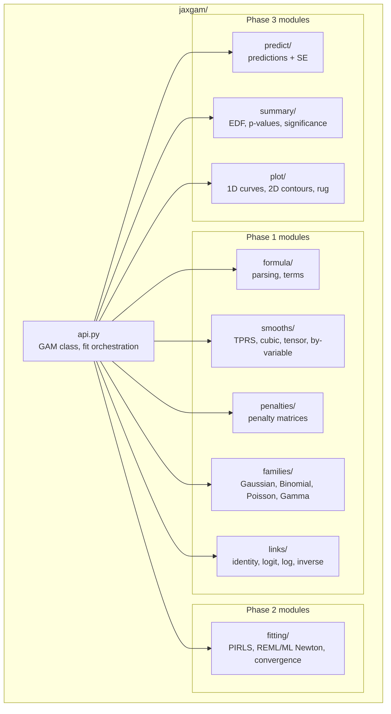

# Contributing to jaxgam

## Getting Started

```bash
git clone https://github.com/<org>/jaxgam.git
cd jaxgam
uv sync --extra dev
make pre-commit-install
```

## Development Workflow

### Running Tests

```bash
# Local tests (R comparison tests auto-skip without correct R version)
make test-local

# Full test suite in Docker (includes R comparison tests, requires colima/Docker)
make test

# Run R tests for a single file in Docker
make test-file FILE=tests/test_smooths/test_tprs.py

# Tests with coverage
make test-cov
```

### Linting

```bash
make lint        # ruff check + format check + vulture
make format      # auto-format with ruff
```

### Pre-commit Hooks

Pre-commit hooks run linting on every commit. Install them once:

```bash
make pre-commit-install
```

## Docker Test Environment

R comparison tests require pinned **R 4.5.2** + **mgcv 1.9-3** for reproducible results. Running locally with a different R version will cause R tests to skip with a version mismatch message.

The Docker environment provides the exact pinned versions:

```bash
# Install colima + docker CLI (macOS)
brew install colima docker

# Run full suite (starts colima automatically)
make test
```

## Architecture

Read [AGENTS.md](AGENTS.md) for the full architecture guide.

Every `GAM.fit()` call flows through three phases. This boundary is load-bearing - do not mix phases. Phase 1 modules must never import JAX.

```mermaid
flowchart LR
    subgraph Phase1["Phase 1 - Setup (NumPy)"]
        direction TB
        P["Formula Parser"]
        P --> S["Smooth Construction<br/>basis + penalty matrices"]
        S --> D["Design Matrix Assembly<br/>X, S, constraints"]
    end

    subgraph Phase2["Phase 2 - Fit (JAX JIT)"]
        direction TB
        PIRLS["PIRLS Inner Loop<br/>penalized IRLS"]
        REML["REML/ML Outer Loop<br/>Newton optimization of λ"]
        REML --> PIRLS
    end

    subgraph Phase3["Phase 3 - Post-estimation (NumPy)"]
        direction TB
        PR["predict()"]
        SU["summary()"]
        PL["plot()"]
    end

    Phase1 - "jax.device_put<br/>X, S_λ → device" --> Phase2
    Phase2 - "np.asarray<br/>β, H⁻¹ → CPU" --> Phase3
```



## Project Structure

```
jaxgam/
├── jaxgam/                     # Library source
│   ├── __init__.py             # Public API: GAM
│   ├── api.py                  # GAM class, fit orchestration
│   ├── jax_utils.py            # JAX helpers (slogdet, pseudo-det)
│   ├── formula/                # Phase 1: parsing
│   │   ├── parser.py           # AST-based formula parser
│   │   ├── terms.py            # Term representation
│   │   └── design.py           # Design matrix assembly
│   ├── smooths/                # Phase 1: basis construction
│   │   ├── base.py             # Smooth base class
│   │   ├── tprs.py             # Thin-plate regression splines
│   │   ├── cubic.py            # Cubic regression splines (cr, cs, cc)
│   │   ├── tensor.py           # Tensor products (te, ti)
│   │   ├── by_variable.py      # Factor-by smooths
│   │   ├── constraints.py      # Sum-to-zero constraints
│   │   └── registry.py         # Smooth type registry
│   ├── families/               # Families (Phase 1 + 2)
│   │   ├── base.py             # Family base class
│   │   ├── standard.py         # Gaussian, Binomial, Poisson, Gamma
│   │   └── registry.py         # Family registry
│   ├── links/                  # Link functions
│   │   └── links.py            # identity, logit, log, inverse
│   ├── penalties/              # Penalty matrices
│   │   └── penalty.py          # Penalty construction
│   ├── fitting/                # Phase 2: JAX JIT-compiled fitting
│   │   ├── data.py             # FittingData preparation + reparameterization
│   │   ├── pirls.py            # Penalized IRLS inner loop
│   │   ├── reml.py             # REML/ML criterion + derivatives
│   │   ├── newton.py           # Outer Newton optimizer for λ
│   │   └── initialization.py   # Initial smoothing parameters
│   ├── predict/                # Phase 3: prediction
│   ├── summary/                # Phase 3: summary + significance
│   │   ├── summary.py          # EDF, p-values, R-squared
│   │   └── _davies.py          # Chi-squared mixture approximation
│   └── plot/                   # Phase 3: plotting
│       └── plot_gam.py         # 1D curves, 2D contours, rug
├── tests/
│   ├── conftest.py             # Shared fixtures, R bridge setup
│   ├── r_bridge.py             # R interface for comparison tests
│   ├── tolerances.py           # STRICT / MODERATE / LOOSE
│   ├── test_api/               # GAM end-to-end tests
│   ├── test_fitting/           # PIRLS, REML, Newton tests
│   ├── test_formula/           # Parser + design matrix tests
│   ├── test_smooths/           # Basis construction tests
│   ├── test_predict/           # Prediction tests
│   ├── test_summary/           # Summary + significance tests
│   ├── test_plot/              # Plotting tests
│   ├── test_families.py        # Family tests
│   ├── test_links.py           # Link function tests
│   ├── test_penalties.py       # Penalty matrix tests
│   └── test_constraints.py     # Constraint tests
├── scripts/                    # Benchmarking + demos
├── docs/                       # Design doc, quickstart, API reference
├── docker/
│   └── renv.lock               # Pinned R packages (mgcv 1.9-3)
├── .github/workflows/          # CI (lint, test matrix, Docker R tests)
├── Dockerfile                  # Test image (R 4.5.2 + Python 3.13)
├── Makefile                    # Dev commands (test, lint, docker)
├── pyproject.toml              # Project metadata + dependencies
└── uv.lock                    # Locked Python dependencies
```

## Testing Rules

- Every new module gets a corresponding test file.
- Use tolerance classes from `tests/tolerances.py`: `STRICT`, `MODERATE`, `LOOSE`.
- R comparison tests use `tests/r_bridge.py`. Results **must** match R at `STRICT` or `MODERATE` tolerance.
- All new modules must have > 80% test coverage.
- Hard-gate invariants (objective monotonicity, H symmetry/PSD, penalty PSD, no NaN) block the build on failure.

## PR Conventions

- One logical change per commit.
- Every PR must include tests.
- PR title format: `[phase] component: description` - e.g., `[phase1] smooths/tprs: implement thin plate basis construction`.
- If a change touches Phase 2 code, include a JIT compilation test.

## What Is NOT in v1.0

Do not implement sparse solvers, `bam()`, extended families (NB, Tweedie, etc.), random effects, P-splines, multi-GPU, `gamm()`, or GCV/UBRE. See [AGENTS.md](AGENTS.md) for the full list.

## Getting Help

Open an issue on GitHub for bugs or feature requests.
