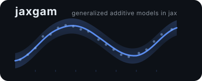
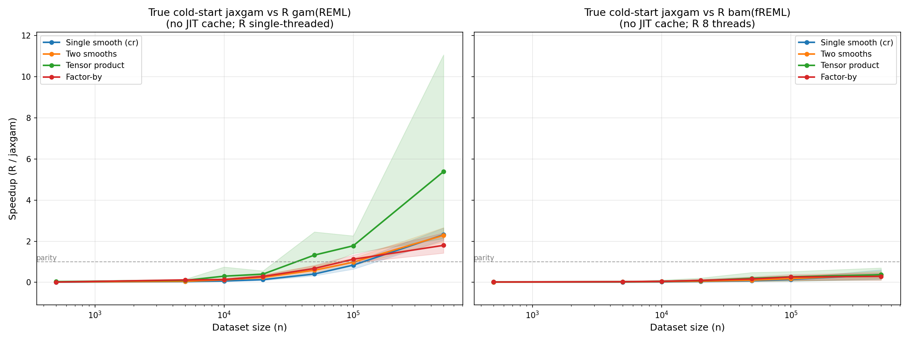
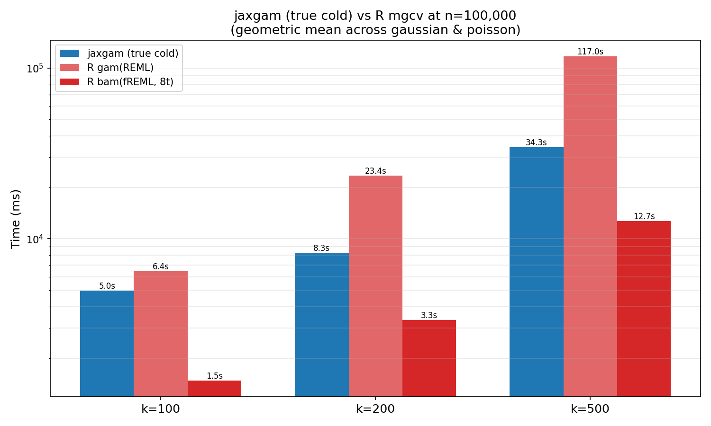

<p align="center">
  
</p>

<p align="center">
  <a href="https://codecov.io/gh/scatt67/jaxgam">
    
  </a>
</p>

A Python port of R's
[mgcv](https://cran.r-project.org/package=mgcv) package by
[Simon N. Wood](https://webhomes.maths.ed.ac.uk/~swood34/), for fitting
Generalized Additive Models. mgcv is the gold-standard GAM library and
the algorithms in jaxgam - penalised iteratively re-weighted least
squares (PIRLS), Laplace-approximate REML (empirical bayes), and the full smooth
construction pipeline - follow Wood's `mgcv` package, published methods, and his
[*Generalized Additive Models: An Introduction with R*](https://www.routledge.com/Generalized-Additive-Models-An-Introduction-with-R-Second-Edition/Wood/p/book/9781498728331) textbook.

Full attribution is given to Simon Wood and the R `mgcv` package, `jaxgam` being a derivative work follows the same [license](LICENSE) as such.

jaxgam uses [jax](https://github.com/google/jax) for JIT-compiled fitting
with automatic differentiation through the PIRLS inner loop and Newton
outer loop, and [numba](https://numba.pydata.org/) eager compilation for TPRS/tensor basis construction and p-value computation. The reason for doing this is because `mgcv` has custom C code for performance critical portions of the code.

## AI / Agentic development transparency note

This project was built heavily with [Claude Code](https://docs.anthropic.com/en/docs/claude-code).
I wanted to learn the tool while porting my favorite R package, so this
was the excuse. It's a side project for fun and learning, but I tried to
test thoroughly against R's reference output so it might actually be useful
to someone.

My strategy was to first create an in depth [design document](docs/design.md) which I went back and forth with claude and third party AI reviewers on to flesh out the design and scope. I then used claude to create an [implementation plan](docs/IMPLEMENTATION_PLAN.md) from the design doc.

What I found helpful was including a local mgcv source and an [R reference map](docs/R_SOURCE_MAP.md) for agents to utilize when porting certain functionality. While others have used skills, I just used an [AGENTS.md](AGENTS.md) file with certain instructions. Though I did have to constantly remind the agent to check it...

Some issues I found with claude/agents, 1. I had to review the tests closely, they tried to cheat by changing the tolerances for `np.assert*`, 2. When they read a lot of R code they don't adhere to idiomatic python (which I thought was personally interesting). I used ruff in our pre-commit to try and catch some of this, but whatever ruff or I didn't catch I add an independent review agent go through later and check for PEP violations. 3. Even with AGENTS.md it still would forget to use tooling provided in the repo from time to time (e.g. `uv`), maybe I should have setup one of those skills ?  

Overall, this was fun I learned a lot about agents/claude code, but I also learned more about mgcv. While I thought I knew a decent amount, and I have perused the source code and docs many times in the past there was still implementations I never knew of (Some custom C implementations I didn't know of !). Is this a production ready package, most likely not... but maybe it can be useful, and a demonstration of want agentic development can do. 

### AI development knowledge sharing

An interesting workflow that I learned to use and worked well (which in hindsight is obvious) for very hard problems is to setup an experiment tracking document. What I found was that even though claude code had a `MEMORY.md` it still can get circular when it comes to solving hard problems. My presumption is that it loses context. 

Example: 

For the Newton optimzer used in the smoothing parameter outer loop had many convergence problems as we missed many conventions used by mgcv in our design document setup, e.g. there is a C implementation `gdi.c` which has many optimization helpers that I didn't know of, and we weren't fully differentiating through the PIRLs loop (treating it as a constant, linear convergence). When going back and forth with claude code it was just spinning in circles, even if I restarted the session to clear context and rely on it's "memory" the result was the same.

The break through came when we setup an experiment document to track past experiments in improving the convergence. On each prompt to claude I refered this document, and had it update it after each go at solving the convergence issue. Within a very few iterations claude was able to solve the problem for most families (later we fixed the Gaussian). For the benefit of others (and transparency) I included this [experiments](docs/experiments.md) document! The end solution was a `custom_jvp` for PIRLS inner loop which is obvious in hindsight. 


## Installation

```bash
# Clone and install with uv
git clone https://github.com/scatt67/jaxgam.git
cd jaxgam
uv sync
```

## Quickstart

```python
import numpy as np
import pandas as pd
from jaxgam import GAM

# Generate data
rng = np.random.default_rng(42)
x = rng.uniform(0, 1, 200)
y = np.sin(2 * np.pi * x) + rng.normal(0, 0.3, 200)
data = pd.DataFrame({"x": x, "y": y})

# Fit a GAM — fit() returns a GAMResults object
results = GAM("y ~ s(x, k=10, bs='cr')").fit(data)

# Inspect results
results.summary()
fig, axes = results.plot()

# Predict on new data
newdata = pd.DataFrame({"x": np.linspace(0, 1, 100)})
predictions = results.predict(newdata)
predictions, se = results.predict(newdata, se_fit=True)
```

See [docs/quickstart.md](docs/quickstart.md) for a full tutorial covering
all families, smooth types, and post-estimation tools.

## What v1.0 supports

### Families

Gaussian, Binomial, Poisson, Gamma, and Negative Binomial - each with
its default link and REML/ML smoothing parameter selection. The Negative
Binomial is an extended family with an estimated dispersion parameter
(theta).

### Smooth types

| Formula syntax | Basis type |
|---|---|
| `s(x, bs='tp')` | Thin-plate regression spline (default) |
| `s(x, bs='cr')` | Cubic regression spline |
| `s(x, bs='cs')` | Cubic spline with shrinkage |
| `s(x, bs='cc')` | Cyclic cubic spline |
| `te(x1, x2)` | Tensor product smooth |
| `ti(x1, x2)` | Tensor interaction (no main effects) |
| `s(x, by=fac)` | Factor-by smooth (separate curve per level) |

### Post-estimation

- `predict()` - response or link scale, with optional standard errors
- `summary()` - parametric and smooth term significance tests
- `plot()` - 1D smooth curves with SE bands, 2D contour plots, rug marks

## v1.0 limitations

These are deliberate scope boundaries, not bugs:

1. **No sparse solver.** Models with > ~5,000 basis functions will hit the
   dense memory ceiling. Factor-by with many levels or large tensor products
   are most affected.
2. **Five families only.** Tweedie, Beta, and other extended families
   beyond Negative Binomial are not yet available.
3. **Dense design matrix must fit in memory.** Datasets with > ~10M rows
   require chunked processing, which is not implemented.
4. **No factor-smooth interactions.** `bs="fs"` requires sparse linear
   algebra and is not implemented. Simple dense random effects
   (`bs="re"`, including random slopes) *are* supported — see the
   quickstart.
5. **No GAMM.** Correlated random effects (`gamm()`) are not supported.

See the [design document](docs/design.md) Section 1.2 for details on what
is planned for v1.1+.

## Performance

jaxgam uses JAX's XLA compiler for JIT-compiled fitting. Performance
depends on whether the JIT cache is warm (compiled code reused) or cold
(first fit triggers compilation). R is benchmarked with both
`gam(method="REML")` and `bam(method="fREML")`.

**Note on R's BLAS:** R is benchmarked using its default (reference) BLAS
and LAPACK, which are notoriously slow. Building R with OpenBLAS would
give R a significant speedup, but we avoided this because OpenBLAS must
be compiled from source with multi-threading disabled — Simon Wood notes
in the [mgcv changelog](https://github.com/cran/mgcv/blob/master/ChangeLog#L13-L16)
that multi-threaded BLAS can cause issues with mgcv's internal
parallelism. The benchmarks therefore reflect a common R installation
rather than an optimally configured one.

### Benchmark results

Full benchmark comparing jaxgam (cold, warm) against R
`gam(REML)`. Iteration counts are included to show that both
implementations converge in a similar number of outer Newton steps.
The Negative Binomial (nb) is an extended family with an outer loop
over the dispersion parameter theta, which adds overhead to both
cold and warm fits.

| smooth | family | n | cold (ms) | warm (ms) | R gam (ms) | cold/R | warm/R | py iter | R iter |
|--------|--------|---:|---:|---:|---:|---:|---:|---:|---:|
| cr | gaussian | 500 | 5 | 6 | 7 | 1.3x | 1.2x | 5 | 5 |
| cr | gaussian | 2,000 | 1,156 | 10 | 15 | 0.01x | 1.5x | 7 | 7 |
| cr | gaussian | 10,000 | 1,038 | 25 | 55 | 0.05x | 2.2x | 8 | 8 |
| cr | gaussian | 100,000 | 1,199 | 192 | 931 | 0.78x | 4.8x | 10 | 10 |
| cr | gaussian | 500,000 | 1,081 | 1,226 | 4,228 | 3.9x | 3.4x | 11 | 11 |
| cr | poisson | 500 | 12 | 6 | 9 | 0.78x | 1.6x | 3 | 2 |
| cr | poisson | 2,000 | 1,048 | 10 | 15 | 0.01x | 1.5x | 3 | 4 |
| cr | poisson | 10,000 | 1,032 | 29 | 68 | 0.07x | 2.3x | 5 | 5 |
| cr | poisson | 100,000 | 1,230 | 203 | 1,070 | 0.87x | 5.3x | 6 | 7 |
| cr | poisson | 500,000 | 1,249 | 1,519 | 5,102 | 4.1x | 3.4x | 7 | 8 |
| cr | binomial | 500 | 8 | 7 | 7 | 0.93x | 1.0x | 3 | 3 |
| cr | binomial | 2,000 | 1,399 | 14 | 12 | 0.01x | 0.86x | 5 | 4 |
| cr | binomial | 10,000 | 1,075 | 43 | 67 | 0.06x | 1.6x | 6 | 5 |
| cr | binomial | 100,000 | 1,281 | 274 | 865 | 0.68x | 3.2x | 7 | 6 |
| cr | binomial | 500,000 | 1,653 | 1,953 | 5,342 | 3.2x | 2.7x | 9 | 8 |
| cr | gamma | 500 | 11 | 9 | 12 | 1.1x | 1.4x | 3 | 5 |
| cr | gamma | 2,000 | 1,302 | 12 | 18 | 0.01x | 1.5x | 3 | 6 |
| cr | gamma | 10,000 | 1,303 | 30 | 88 | 0.07x | 2.9x | 3 | 7 |
| cr | gamma | 100,000 | 1,527 | 228 | 1,311 | 0.86x | 5.8x | 5 | 9 |
| cr | gamma | 500,000 | 1,387 | 1,648 | 6,702 | 4.8x | 4.1x | 6 | 10 |
| cr | nb | 500 | 578 | 601 | 11 | 0.02x | 0.02x | 4 | 4 |
| cr | nb | 2,000 | 1,859 | 546 | 17 | 0.01x | 0.03x | 3 | 3 |
| cr | nb | 10,000 | 2,274 | 620 | 82 | 0.04x | 0.13x | 5 | 4 |
| cr | nb | 100,000 | 2,405 | 2,047 | 1,281 | 0.53x | 0.63x | 6 | 6 |
| cr | nb | 500,000 | 3,670 | 5,321 | 6,920 | 1.9x | 1.3x | 7 | 7 |
| two | gaussian | 500 | 15 | 11 | 8 | 0.53x | 0.76x | 6 | 6 |
| two | gaussian | 2,000 | 1,025 | 19 | 16 | 0.02x | 0.85x | 8 | 8 |
| two | gaussian | 10,000 | 1,059 | 47 | 81 | 0.08x | 1.7x | 12 | 9 |
| two | gaussian | 100,000 | 1,335 | 332 | 1,016 | 0.76x | 3.1x | 11 | 11 |
| two | gaussian | 500,000 | 1,933 | 2,122 | 6,293 | 3.3x | 3.0x | 12 | 12 |
| two | poisson | 500 | 17 | 12 | 14 | 0.85x | 1.1x | 8 | 8 |
| two | poisson | 2,000 | 975 | 18 | 19 | 0.02x | 1.1x | 6 | 5 |
| two | poisson | 10,000 | 973 | 47 | 109 | 0.11x | 2.3x | 6 | 7 |
| two | poisson | 100,000 | 1,315 | 398 | 1,546 | 1.2x | 3.9x | 7 | 8 |
| two | poisson | 500,000 | 2,410 | 2,851 | 7,801 | 3.2x | 2.7x | 8 | 9 |
| two | binomial | 500 | 19 | 15 | 13 | 0.69x | 0.87x | 9 | 9 |
| two | binomial | 2,000 | 1,077 | 14 | 20 | 0.02x | 1.5x | 3 | 5 |
| two | binomial | 10,000 | 1,094 | 48 | 98 | 0.09x | 2.0x | 5 | 6 |
| two | binomial | 100,000 | 1,846 | 439 | 1,155 | 0.63x | 2.6x | 7 | 7 |
| two | binomial | 500,000 | 2,856 | 3,088 | 7,298 | 2.6x | 2.4x | 8 | 8 |
| two | gamma | 500 | 19 | 11 | 19 | 1.0x | 1.8x | 4 | 6 |
| two | gamma | 2,000 | 1,529 | 22 | 39 | 0.03x | 1.8x | 6 | 8 |
| two | gamma | 10,000 | 1,528 | 48 | 248 | 0.16x | 5.2x | 4 | 9 |
| two | gamma | 100,000 | 1,920 | 442 | 1,986 | 1.0x | 4.5x | 6 | 10 |
| two | gamma | 500,000 | 3,010 | 3,141 | 10,411 | 3.5x | 3.3x | 7 | 11 |
| two | nb | 500 | 733 | 582 | 12 | 0.02x | 0.02x | 4 | 4 |
| two | nb | 2,000 | 1,912 | 570 | 28 | 0.01x | 0.05x | 6 | 6 |
| two | nb | 10,000 | 2,032 | 648 | 121 | 0.06x | 0.19x | 5 | 5 |
| two | nb | 100,000 | 3,011 | 2,761 | 1,801 | 0.60x | 0.65x | 7 | 7 |
| two | nb | 500,000 | 8,455 | 9,735 | 10,291 | 1.2x | 1.1x | 8 | 8 |
| te | gaussian | 500 | 31 | 19 | 14 | 0.45x | 0.75x | 14 | 10 |
| te | gaussian | 2,000 | 1,550 | 23 | 39 | 0.03x | 1.7x | 8 | 9 |
| te | gaussian | 10,000 | 1,422 | 60 | 693 | 0.49x | 11.6x | 10 | 10 |
| te | gaussian | 100,000 | 2,292 | 840 | 4,311 | 1.9x | 5.1x | 14 | 11 |
| te | gaussian | 500,000 | 4,296 | 4,267 | 55,747 | 13.0x | 13.1x | 12 | 13 |
| te | poisson | 500 | 28 | 18 | 17 | 0.61x | 0.93x | 8 | 6 |
| te | poisson | 2,000 | 1,359 | 24 | 35 | 0.03x | 1.4x | 5 | 5 |
| te | poisson | 10,000 | 1,388 | 79 | 168 | 0.12x | 2.1x | 6 | 7 |
| te | poisson | 100,000 | 2,287 | 940 | 2,718 | 1.2x | 2.9x | 8 | 8 |
| te | poisson | 500,000 | 5,965 | 5,240 | 22,669 | 3.8x | 4.3x | 8 | 9 |
| te | binomial | 500 | 52 | 38 | 17 | 0.33x | 0.45x | 14 | 6 |
| te | binomial | 2,000 | 1,539 | 26 | 31 | 0.02x | 1.2x | 5 | 5 |
| te | binomial | 10,000 | 1,517 | 74 | 116 | 0.08x | 1.6x | 5 | 5 |
| te | binomial | 100,000 | 2,361 | 873 | 2,621 | 1.1x | 3.0x | 7 | 8 |
| te | binomial | 500,000 | 5,811 | 5,487 | 15,104 | 2.6x | 2.8x | 8 | 9 |
| te | gamma | 500 | 35 | 21 | 14 | 0.40x | 0.67x | 6 | 6 |
| te | gamma | 2,000 | 1,861 | 47 | 40 | 0.02x | 0.86x | 8 | 7 |
| te | gamma | 10,000 | 1,807 | 83 | 755 | 0.42x | 9.1x | 5 | 9 |
| te | gamma | 100,000 | 2,754 | 1,022 | 4,976 | 1.8x | 4.9x | 7 | 10 |
| te | gamma | 500,000 | 5,928 | 5,721 | 67,537 | 11.4x | 11.8x | 7 | 11 |
| te | nb | 500 | 2,074 | 604 | 20 | 0.01x | 0.03x | 4 | 5 |
| te | nb | 2,000 | 2,214 | 599 | 36 | 0.02x | 0.06x | 4 | 4 |
| te | nb | 10,000 | 2,850 | 699 | 171 | 0.06x | 0.24x | 5 | 5 |
| te | nb | 100,000 | 4,167 | 2,462 | 2,345 | 0.56x | 0.95x | 7 | 7 |
| te | nb | 500,000 | 14,189 | 13,119 | 22,249 | 1.6x | 1.7x | 8 | 8 |
| cr_by | gaussian | 500 | 49 | 32 | 23 | 0.47x | 0.73x | 14 | 10 |
| cr_by | gaussian | 2,000 | 1,341 | 37 | 46 | 0.03x | 1.2x | 13 | 8 |
| cr_by | gaussian | 10,000 | 1,297 | 49 | 137 | 0.11x | 2.8x | 7 | 7 |
| cr_by | gaussian | 100,000 | 2,065 | 743 | 2,026 | 0.98x | 2.7x | 9 | 9 |
| cr_by | gaussian | 500,000 | 5,123 | 4,363 | 13,640 | 2.7x | 3.1x | 10 | 10 |
| cr_by | poisson | 500 | 52 | 24 | 24 | 0.46x | 0.99x | 8 | 8 |
| cr_by | poisson | 2,000 | 1,561 | 42 | 47 | 0.03x | 1.1x | 7 | 7 |
| cr_by | poisson | 10,000 | 1,318 | 71 | 154 | 0.12x | 2.2x | 5 | 5 |
| cr_by | poisson | 100,000 | 2,130 | 1,012 | 2,408 | 1.1x | 2.4x | 6 | 6 |
| cr_by | poisson | 500,000 | 5,334 | 5,546 | 14,780 | 2.8x | 2.7x | 6 | 7 |
| cr_by | binomial | 500 | 41 | 29 | 23 | 0.56x | 0.79x | 8 | 8 |
| cr_by | binomial | 2,000 | 1,370 | 41 | 46 | 0.03x | 1.1x | 8 | 7 |
| cr_by | binomial | 10,000 | 1,331 | 87 | 146 | 0.11x | 1.7x | 5 | 5 |
| cr_by | binomial | 100,000 | 2,324 | 1,222 | 1,837 | 0.79x | 1.5x | 7 | 5 |
| cr_by | binomial | 500,000 | 7,059 | 7,172 | 12,379 | 1.8x | 1.7x | 8 | 6 |
| cr_by | gamma | 500 | 27 | 16 | 18 | 0.68x | 1.1x | 4 | 5 |
| cr_by | gamma | 2,000 | 1,644 | 23 | 40 | 0.02x | 1.8x | 3 | 5 |
| cr_by | gamma | 10,000 | 1,655 | 85 | 239 | 0.14x | 2.8x | 5 | 6 |
| cr_by | gamma | 100,000 | 2,361 | 865 | 3,010 | 1.3x | 3.5x | 4 | 8 |
| cr_by | gamma | 500,000 | 5,642 | 5,623 | 17,426 | 3.1x | 3.1x | 5 | 9 |
| cr_by | nb | 500 | 2,544 | 570 | 19 | 0.01x | 0.03x | 4 | 4 |
| cr_by | nb | 2,000 | 2,110 | 618 | 53 | 0.03x | 0.09x | 6 | 6 |
| cr_by | nb | 10,000 | 2,181 | 709 | 173 | 0.08x | 0.24x | 4 | 4 |
| cr_by | nb | 100,000 | 4,051 | 3,589 | 2,599 | 0.64x | 0.72x | 5 | 5 |
| cr_by | nb | 500,000 | 17,566 | 19,861 | 16,859 | 0.96x | 0.85x | 7 | 6 |

### Cold starts

The first fit includes JIT tracing + XLA compilation (~900-1500ms
overhead). This makes jaxgam slower than R for small datasets on first
use, but the compiled code is cached to disk and reused across sessions.



The crossover where even a cold jaxgam fit beats `gam(REML)` is around n=100,000. The `bam(fREML)` wins in all n as it was purpose built for fitting very large data! Many people don't associate `mgcv` for large scale training, but if this benchmark shows anything is that it is certainly up for the task!

### High-dimensional models

For models with many basis functions (k=100-500), jaxgam's XLA-compiled
dense linear algebra outperforms R `gam(REML)` even on the very first
cold-start fit. We also benchmark against R's `bam(fREML)` with 8
threads, which was purpose-built for large datasets and is very fast at
high k. A `bam(fREML)` port is on the roadmap.



Note: jaxgam currently implements `gam(REML)` only. The benchmarks above
compare against both R's `gam(REML)` (apples-to-apples) and `bam(fREML)`
(to show what mgcv can do with its large data optimizer!).

### When to use jaxgam

**jaxgam is a good fit when:**
- You want REML based GAMs in Python. AFAIK other Python GAM
  implementations offer Generalized Cross Validation (GCV) or full
  Bayes, whereas REML (empirical Bayes) is generally more robust than
  GCV and faster than full Bayes
- You fit the same model structure repeatedly (bootstrap, CV,
  simulation) - warm fits are 2-13x faster than R `gam(REML)` for
  standard families (Gaussian, Poisson, Binomial, Gamma)
- Your datasets are large (n > 100,000) - the XLA advantage grows
  with n

**R's mgcv may be better when:**
- You don't care about using python or R you just care about the best tool for the job, or you can use R in your production environement (R is a great tool) !
- You need one-shot fits on small data (n < 100,000) and cold-start
  latency matters
- You can use `bam(fREML)` for very large datasets, or features beyond
  v1.0 scope (sparse solvers, Tweedie/Beta and other extended families,
  factor-smooth interactions)

In most cases you probably should just use the original `mgcv` in R it's very robust and efficient! If you are a pure python user, or your tech stack only supports python maybe jaxgam can be useful.

A persistent compilation cache (`~/.cache/jaxgam/jax/`) is enabled by
default to minimize cold-start overhead across Python sessions.
Disable it with `JAXGAM_NO_COMPILATION_CACHE=1`.

## Correctness

jaxgam is validated against R's mgcv 1.9-3 across a 1,450-test suite.
Every model configuration (5 families x 6 smooth types) is fitted in
both jaxgam and R, then compared value-by-value:

- **Coefficients, fitted values, deviance** - must match R at STRICT
  (rtol=1e-10) or MODERATE (rtol=1e-4) tolerance depending on the
  model type
- **Smoothing parameters** - compared at MODERATE or LOOSE (rtol=1e-2)
  because the REML surface is flat near the optimum
- **Basis matrices and penalty matrices** - compared element-wise
  against R's `smoothCon()` output with sign normalization to handle
  LAPACK eigenvector sign ambiguity
- **Summary statistics** - EDF, p-values, and significance tests
  validated against R's `summary.gam()`
- **Predictions and standard errors** - `predict()` output compared
  against R's `predict.gam()` on both training and new data

R comparison tests run inside a Docker container with pinned R 4.5.2 +
mgcv 1.9-3 to ensure reproducibility. Tests are skipped automatically
when running locally without the correct R version.

Hard-gate invariants are checked on every test run: REML objective
monotonicity, Hessian symmetry/PSD, penalty PSD, EDF bounds, deviance
non-negativity, and no NaN in converged models.

## Development

```bash
# Install dev dependencies
uv sync --extra dev

# Run tests locally (R tests auto-skip without pinned R version)
make test-local

# Run full test suite in Docker (includes R comparison tests)
make test

# Run linter
make lint
```

See [CONTRIBUTING.md](CONTRIBUTING.md) for the full development guide,
including Docker setup, testing rules, and PR conventions.

## Citations

jaxgam is a Python port of Simon Wood's
[mgcv](https://cran.r-project.org/package=mgcv) R package. The
statistical methods are entirely his work. If you use jaxgam, please
cite the relevant mgcv papers:

- **GAM method (REML/ML estimation)** -- Wood SN (2011). "Fast stable restricted maximum likelihood and marginal likelihood estimation of semiparametric generalized linear models." *Journal of the Royal Statistical Society (B)*, 73(1), 3--36. [doi:10.1111/j.1467-9868.2010.00749.x](https://doi.org/10.1111/j.1467-9868.2010.00749.x)

- **Beyond exponential family** -- Wood SN, Pya N, Säfken B (2016). "Smoothing parameter and model selection for general smooth models (with discussion)." *Journal of the American Statistical Association*, 111, 1548--1575. [doi:10.1080/01621459.2016.1180986](https://doi.org/10.1080/01621459.2016.1180986)

- **GCV-based model method and basics of GAMM** -- Wood SN (2004). "Stable and efficient multiple smoothing parameter estimation for generalized additive models." *Journal of the American Statistical Association*, 99(467), 673--686. [doi:10.1198/016214504000000980](https://doi.org/10.1198/016214504000000980)

- **Overview** -- Wood SN (2017). *Generalized Additive Models: An Introduction with R*, 2 edition. Chapman and Hall/CRC.

- **Thin plate regression splines** -- Wood SN (2003). "Thin-plate regression splines." *Journal of the Royal Statistical Society (B)*, 65(1), 95--114. [doi:10.1111/1467-9868.00374](https://doi.org/10.1111/1467-9868.00374)

See [CITATION.cff](CITATION.cff) for machine-readable citation metadata
and BibTeX entries.

## License

Licensed under [GPL-2.0-or-later](LICENSE), matching mgcv's `GPL (>= 2)`
license. As a derivative work of mgcv, this ensures downstream users have
the same freedoms granted by the original package.
